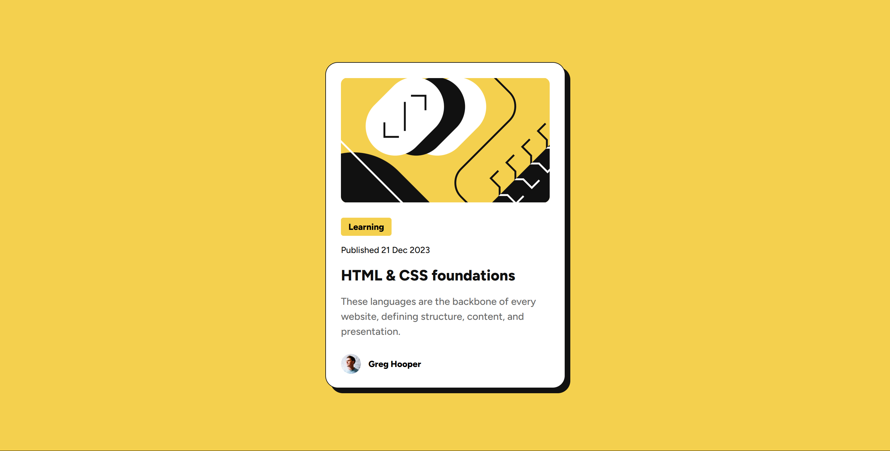

# Frontend Mentor - Blog preview card solution

This is a solution to the [Blog preview card challenge on Frontend Mentor](https://www.frontendmentor.io/challenges/blog-preview-card-ckPaj01IcS). Frontend Mentor challenges help you improve your coding skills by building realistic projects. 

## Table of contents

- [Overview](#overview)
  - [Screenshot](#screenshot)
  - [Links](#links)
- [My process](#my-process)
  - [Built with](#built-with)
  - [What I learned](#what-i-learned)
- [Author](#author)

## Overview

### Screenshot




### Links

- Solution URL: [Add solution URL here](https://your-solution-url.com)
- Live Site URL: [https://yetithesleepingchancellor.github.io/blog-preview-card/](https://yetithesleepingchancellor.github.io/blog-preview-card/)

## My process

### Built with

- Semantic HTML5 markup
- CSS custom properties
- Flex-box
- Mobile-first workflow

### What I learned

```html
<time class="date" datetime="2023-12-21">Published 21 Dec 2023</time>
```
```html
<article class="card">
    ....

    <footer class="author">
    ....
    </footer>
</article>
```

```css
@font-face {
    font-family: 'Figtree ExtraBold';
    src: url('../assets/fonts/static/Figtree-ExtraBold.ttf') format('truetype');
}

@font-face {
    font-family: 'Figtree Medium';
    src: url('../assets/fonts/static/Figtree-Medium.ttf') format('truetype');
}
```

## Author

- Website - [Sandip Tamang](https://www.tamangsandip.com.np)
- Frontend Mentor - [@YetiTheSleepingChancellor](https://www.frontendmentor.io/profile/YetiTheSleepingChancellor)
- Linkedin - [Sandip Tamang](https://www.linkedin.com/in/sandiptamang/)